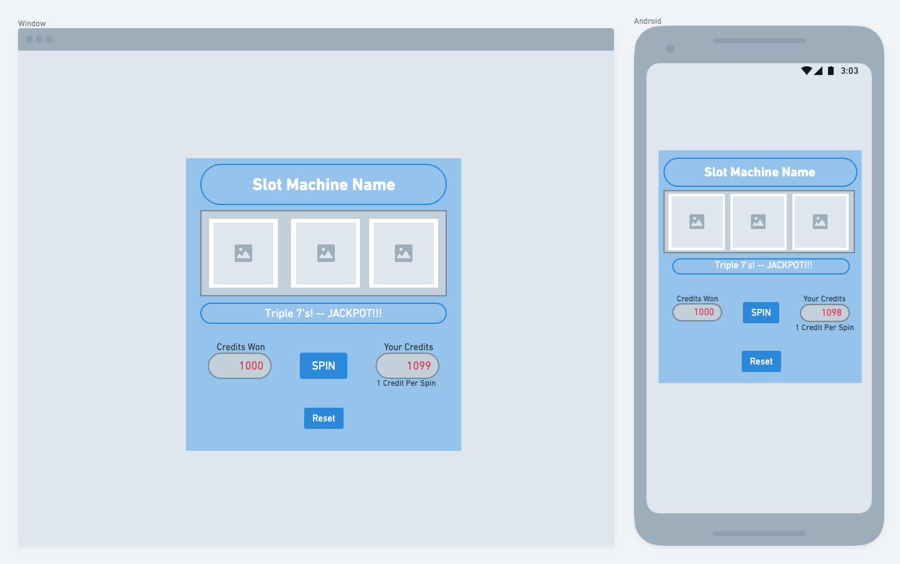
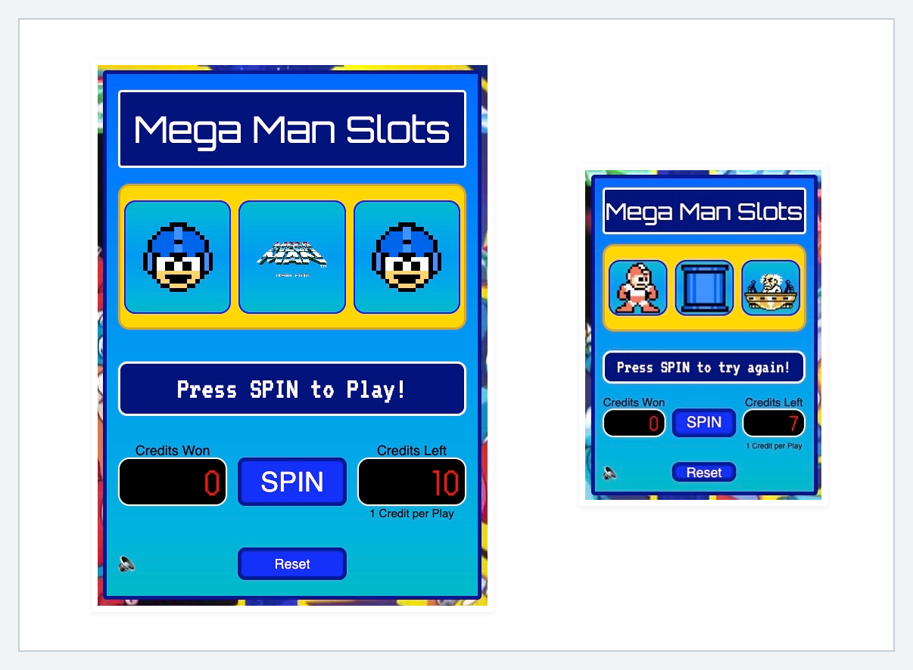

# JavaScript Slot Machine Project
### by Matt Packer

## About

[Hello, World!](https://en.wikipedia.org/wiki/%22Hello,_World!%22_program) My name is Matt Packer. I am an aspiring software engineer, and this is my first major web development project. I am completing this project as part of [General Assembly](https://www.generalassemb.ly)'s intense Software Engineering Immersive program that I am a fellow in.

The assigned task was to create a web-based application that is a 'game', in order to help me learn to think more like a programmer. This project gave me an opportunity to be creative and to solve problems while encountering some difficult programming challenges.

I hope you enjoy my 'Mega Man' themed JavaScript Slot Machine game!

## Getting Started

My game was deployed using Surge, and can be found here: https://mp-js-slot-machine-project.surge.sh/

* The game was created using a 'moblie-first' design and is responsive so that renders at a smaller or larger size depending on the screen size.

## Technical Summary

* Technology used in development:
  * JavaScript - ES6
  * HTML5
  * CSS3
  * Git
  * GitHub
  * Surge

## App Requirement Summary

* Define the required constants.
  
* Define the required variables to track the state of the game.
  
* Store the elements on the page that will be accessed in the code more than once as variables.
  
* Upon loading, the game should:
  * Initialize the game state variables.
  * Render those values on the page.
  * Wait for the user to press the spin button to play the game.
  
* Handle a player clicking the spin button.
  
* Handle a player clicking the reset button.

## Game Summary

* Display a slot machine layout when the webpage loads. This includes:
  
  * Body of the machine.

  * Three boxes where the 'reels' will display values based on random numbers generated, and predetermined odds for each potential value ('Payout' for 3-in-a-row of each element):
    * eTank (50 credits) - most common
    * Met (100 credits)
    * Proto Man (250 credits)
    * Dr. Wily (500 credits)
    * Mega Man (Jackpot - 1000 credits) - least common

  * Display credits remaining (start with 10 - 1 credit will be used each time the player spins the reels).

  * Display the number of credits won on a spin (payouts for 3-in-a-row).

  * Button to spin the 'reels' and play the game.

  * Reset button to reload the game to the initial state.

* HOW TO PLAY:
  * This is a game of chance.
  * When the 'SPIN' button is pressed the reels 'spin' and three images appear randomly in the 'reel' boxes.
  * The objective is to get three matching images, and to avoid running out of credits.
  * To play, press the 'SPIN' button.
  * 1 credit will be deducted for each spin.
  * If 0 credits remain, use the 'RESET' button to reset the game to the original state and try again.

## Pseudocode

* Constants:
  * Reel Images:
    * eTank
    * Met
    * Proto Man
    * Dr. Wily
    * Mega Man
  * Default Reel Images:
    * Mega Man 1-Up
    * Mega Man Title
  * Spin Animation Image:
    * Mega Man Spin

* Variables - state:
  * Reel 1 State
  * Reel 2 State
  * Reel 3 State
  * Win State
  * Win Credits
  * Credits Remaining
  * Random Number 1
  * Random Number 2
  * Random Number 3
  * Sound Status

* Cached Element References:
  * Slot Reel 1
  * Slot Reel 2
  * Slot Reel 3
  * Credits Won
  * Credits Remaining
  * Slot Message
  * Sound Image

* Event Listeners:
  * Click 'Spin' Button
  * Click 'Reset' Button
  * Click 'Sound' Button

*  Functions:

   *  Initialize - init:
      *  Loads game to initial state.
      *  Sets most values in variables to 'null', 0, or empty string.
      *  Disables confetti function if active.
      *  Sets reels to default images.
      *  Sets default message saying, 'Press SPIN to play!'.
      *  Sets default credits remaining.
      *  Sets audio to 'on'.
      *  Plays quarter-drop sound.
      *  Is invoked on page load/refresh.
      *  Is invoked when 'reset' button is clicked.
  

   *  Spin:
      *  Disables confetti function if active.
      *  Checks the number of credits remaining:
         *  if < = 0, display game over message
         *  if > 0, continue
      *  Deducts 1 credit from remaining credits.
         *  Updates remaining credits value on screen.
      *  Resets win state variable to an empty string value.
      *  Sets message to 'Reels Spinning...'
      *  Sets reel image values to the 'spin' animation image.
      *  Plays lever sound.
      *  Plays spin sound.
      *  Invokes function to 'spin' reel 1.
      *  Invokes function to 'spin' reel 2.
      *  Invokes function to 'spin' reel 3.
      *  Invokes function to check for a win.
  

   *  Spin Reel 1:
      *  Generates a random number between 1 and 100.
      *  Assigns the random number value to the Random Number 1 variable.
      *  Uses if...else statement to evaluate the random number and assigns the value for the reel 1 state variable.
  

   *  Spin Reel 2:  
      *  Generates a random number between 1 and 100.
      *  Assigns the random number value to the Random Number 2 variable.
      *  Uses if...else statement to evaluate the random number and assigns the value for the reel 2 state variable.

   *  Spin Reel 3:  
      *  Generates a random number between 1 and 100.
      *  Assigns the random number value to the Random Number 3 variable.
      *  Uses if...else statement to evaluate the random number and assigns the value for the reel 3 state variable.
  

   *  Check Winner:
      *  Compares values of each reel state variable using if...else statement.
      *  Sets the value of the win state variable.
      *  Invokes the render reel 1 function with a timed delay using setTimeout.
  

   *  Render Reel 1:
      *  Plays reel stop sound.
      *  Manipulates the DOM to display reel 1 image based on reel 1 state value.
      *  Invokes the render reel 2 function with a timed delay using setTimeout.
  

   *  Render Reel 2:
      *  Plays reel stop sound.
      *  Manipulates the DOM to display reel 2 image based on reel 2 state value.
      *  Invokes the render reel 3 function with a timed delay using setTimeout.

   *  Render Reel 3:
      *  Plays reel stop sound.
      *  Manipulates the DOM to display reel 3 image based on reel 3 state value.
      *  Invokes the render final function with a timed delay using setTimeout.
  

   *  Render Final:
      *  Checks the win state variable using an if...else statement to:
         *  Change the slot message by manipulating the DOM.
         *  Sets value of the win credits variable.
         *  Manipulates the DOM to change the win credits value displayed.
         *  Sets value of the credits remaining variable - credits won plus the previous credits remaining.
         *  Manipulates the DOM to change the credits remaining value displayed.
         *  Plays the appropriate 'winning' sound effect.
         *  In the event of a jackpot, invokes 'confetti' function to display confetti on screen.
         *  OR
            *  Checks the number of credits remaining:
               *  If there are credits remaining:
                  *  Manipulates the DOM to change the slot message to display 'spin again' message.
               *  If there are NO credits remaining:
                  *  Manipulates the DOM to change the slot message to display 'game over' message.
                  * Plays 'game over' sound effect.
  
    * Sound Toggle
      * Adds functionality to turn sound effects ON or OFF by clicking the 🔈 button.

*  Invoke the init function so that the game loads to the initial state when the page loads.

## Future Enhancements

* Add feature that allows the user to wager more than one credit on a spin and pay out more for a win based on the increased risk.
  
* Add improvements to the game styling.
  
* Add improved special effects when reels are spinning and when the user wins.
  
* Optimize the app for accessibility.
  
* Improve the responsive design further to make the app 100% scalable.

## Special Thanks

* Thank you to the instructors, support staff, and my peers from the General Assembly Software Engineering Immersive remote cohort for their guidance and collaboration while developing this project.

* I have always been a huge fan of Mega Man, and many of the titles that Capcom has produced over the years. Many of the graphic and audio elements used in this student project are property of [Capcom](https://megaman.capcom.com/).

* I formatted this `README.md` file using markdown after completing a helpful online [tutorial](https://www.markdowntutorial.com/).

* To create the wireframes within this README file, I used an excellent tool called [Whimsical](https://whimsical.com).

* To develop the color palette for this project, I leverage online tools like [Coolers](https://coolors.co/), [ColorSpace](https://mycolor.space/), and [ImageColorPicker.com](https://imagecolorpicker.com/en).

* The fonts used in this project were sourced from [Google Fonts](https://fonts.google.com/).

* Some of the sound effects used in this project were found in a free online database called [Freesound](https://freesound.org/).

* To edit the .GIF files used in this project, I utilized an extremely helpful website with a suite of free tools called [OnlineGifTools](https://onlinegiftools.com/)

* The 'confetti' effect that I used in this project was found on the [CSS Script](https://www.cssscript.com/confetti-falling-animation/) site. Thanks to the author, 'mathusummut', for the great app and easy-to-follow implementation instructions.

* I learned a lot about how to use CSS Flexbox and CSS Grid from the following resources:
  * [Flexbox Froggy](https://flexboxfroggy.com/)
  * [Grid Garden](https://cssgridgarden.com/)
  * [CSS Tricks - Flexbox](https://css-tricks.com/snippets/css/a-guide-to-flexbox/)
  * [CSS Tricks - Grid](https://css-tricks.com/snippets/css/complete-guide-grid/)

## About Mega Man

   Mega Man, known as Rockman (ロックマン, Rokkuman) in Japan, is a Japanese science fiction video game franchise created by Capcom, starring a series of robot characters each known by the moniker "Mega Man". Mega Man, released for the Nintendo Entertainment System in 1987, was the first in a series that expanded to over 50 games on multiple systems. As of December 31, 2019, the game series has sold 36 million units worldwide. Source: [Wikipedia](https://en.wikipedia.org/wiki/Mega_Man).
